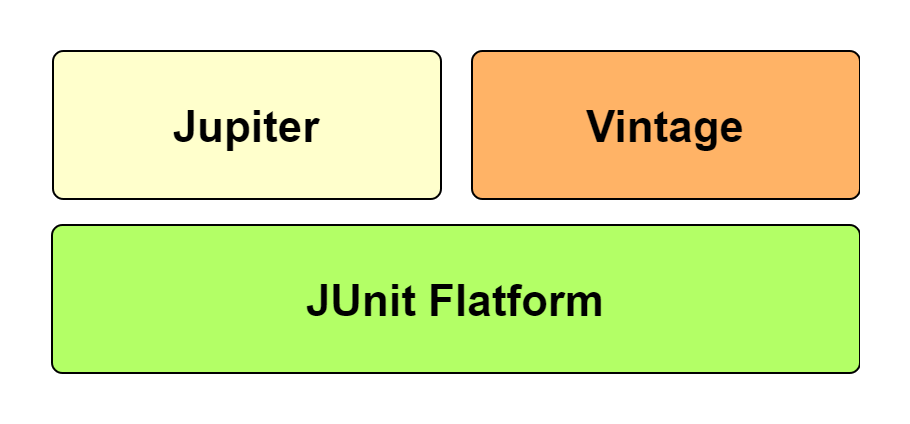

# JUnit_TEST


## JUnit
- java 진영의 대표적인 TestFramework이다. 대부분의 java 개발자는 단위 테스트 도구로 JUnit을 쓴다.
- 단위 테스트를 위한 도구를 제공한다.
    * 코드의 특정 모듈이  의도한 대로 동작하는 절차를 의미
    * 모든 함수오 메소드에 대해서 각각의 단위 테스트가 가능함.
- Assert문을 이용해 수행 결과를 확인 가능하다.
- Spring boot 2.2 버전 부터는 junit5 버전을 사용한다.
- 
<details>
<summary>JUnit 모듈 설명</summary>
<div markdown="1">

### Jupiter
- `TestEngine API` 구현체로 `JUnit5`를 구현하고 있다.
- 테스트의 실제 구현체는 별도 모듈 역할을 수행하는데 , 그 모듈 중 하나로 Jupiter
모듈은 개발자가 테스트 코드를 작성할 때 사용됨.

### JUnit Platform
- test를 실행하기 위한 뼈대
- test를 발견하고 테스트 계획을 생성하는 testEngine 인터페이스를 가지고 있음
- TestEngine을 통해 Test를 발견하고 수행 및 결과를 보고함.
- 각종 IDE 연동을 보조하는 역할 수행(콘솔 출력 .... etc...)
- (Platform = TestEngine API + Console Launcher + JUnit 4 Based Runner 등)

### Vintage
- Junit4, Junit3 같은 레거시 라이브러리를 쓸 수 있게 해준다.



</div>
</details>


<details>
<summary>JUnit 어노테이션 설명</summary>
<div markdown="1">

## @SpringBootTest

- 통합 테스트 용도
- @SpringBootApplicationㅇ르 찾아가 하위의 모든 Bean을 스캔하여 로드
- 그 후 Test용 Application Context를 만들어 Bean을 추가하고, MockBean을 찾아가  교체

## @ExtendWith

- junit4에서 @RunWith로 사용되던 어노테이션
- 테스트에 AOP개념을 활용 할 수 있음
- 오류 핸들러, 인터셉트 가능
- @SpringBootTest에는 기본적으로 @ExtendWith가 추가되어 있음

[JUnit 5 User Guide](https://junit.org/junit5/docs/current/user-guide/#extensions-registration-declarative)

[Junit 5 with Spring Boot: When to use @ExtendWith Spring or Mockito?](https://stackoverflow.com/questions/61433806/junit-5-with-spring-boot-when-to-use-extendwith-spring-or-mockito)

[번외편 - Junit LifeCycle과 @ExtendWith 에 대해 알아보자](https://huisam.tistory.com/entry/junit)

[Spring Boot Context Test - 스프링 컨텍스트 테스트 (aka. IntegrationTest)](https://huisam.tistory.com/entry/springBootTest)

[JUnit 5 User Guide](https://junit.org/junit5/docs/current/user-guide/#writing-tests-assumptions)

[JUnit 5.8.2 API](https://junit.org/junit5/docs/current/api/)

## @WebMvcTest(Class명.class)

- ()에 작성된 클래스만 실제로 로드하여 테스트를 진행
- 매개변수를 지정해주지 않으면 @Controller, @RestController, @RestControllerAdvice 등 컨트롤러와 연관된 bean을 로드함
- 스프링의 모든 Bean을 로드하는 @SpringBootTest대신 컨트롤러 관련 코드만 테스트 할 경우 사용됨(SpringBootTest보다 상대적으로 가볍다.)
</div>

## @RepeatedTest
```java
public class RepeatedAnnotationTest {

    // 5번 반복
    @RepeatedTest(5)
    void repeated1(RepetitionInfo repetitionInfo) {
        Assertions.assertEquals(5, repetitionInfo.getTotalRepetitions());
    }

    /*
        1. displayName => @DisplayName
        2. currentRepetition => 현재 반복수
        3. totalRepetitions => total 반복수
     */
    @RepeatedTest(value=5, name="{displayName} {currentRepetition}/{totalRepetitions}")
    @DisplayName("Repeat!..")
    void customDisplayName(TestInfo testInfo) {
        Assertions.assertEquals("Repeat!.. 1/5", testInfo.getDisplayName());
    }


}
```

어떤 테스트를 반복해서 테스트 할 때 사용한다.

RepetitionInfo는

getTotalRepetitions()로 전체 반복 횟수
getCurrentRepetition()로 현재 반복 수
또는 반복 테스트를 커스터마이징 해서 사용 할 수 있다.


## @ParameterizedTest
지원 타입 : short[], byte[], int[], long[], float[], double[], char[], boolean[], String[], Class<?>[]

### @ValueSource(ints={1,2,3.....})
배열로 정의한 여러 값을 하나의 매개변수에서 모두 테스트 해볼 때 사용한다.

```java
// 지원 타입 : short[], byte[], int[], long[], float[], double[], char[], boolean[], String[], Class<?>[]
@ParameterizedTest
@ValueSource(ints={1,2,3})
void testWithValueSource(int intArg) {
assertTrue(intArg > 0 && intArg < 4);
}
```
### @NullSource
```java

@ParameterizedTest
@NullSource
void testWithNullSource(Integer intArg) {
assertTrue(intArg == null);
}
```
### @EnumSource(value= *.class)
```java

// 해당하는 enum의 모든 값을 검사함
@ParameterizedTest
@EnumSource(value= Month.class)
void testWithEnumSource(Month month) {

}
```


```java
// enum name이 "May" 인 것만 검사
@ParameterizedTest
@EnumSource(mode= EnumSource.Mode.INCLUDE, names={"MAY"})
void testWithEnumSourceInclude(Month month) {

}

// enum name이 "May"가 아닌 것만 검사
@ParameterizedTest
@EnumSource(mode= EnumSource.Mode.EXCLUDE, names={"MAY", "MARCH"})
void testWithEnumSourceExclude(Month month) {

}
```
Enum에서 EXCLUDE는 name 목록에 있는 것을 제외한 나머지 케이스를 테스트한다.

INCLUDE는 enum 목록에서 Name 목록만 테스트 케이스로 활용


### @CsvSource
```java
@ParameterizedTest
@CsvSource(value= {
"apple, 1",
"banana, 2",
"'lemon, lime', 0xF1",
"'', 10"
}, delimiter = ',', emptyValue = "1") // emptyValue= 빈값을 지정 값으로 바꿈
void testWithCsvSource(String fruit, int rank) {
assertNotNull(fruit);
assertNotEquals(0, rank);
}

@ParameterizedTest
@CsvSource(value= {
"apple, NL",
}, nullValues = {"NL", "apple"}) // NL apple 을 null값으로 바꿈
void testWithCsvSource2(String fruit, Integer rank) {
assertNull(fruit);
assertNull(rank);
}
```
","로 구분해서 여러 파라미터에 동시에 값을 넣는게 가능하다. 쉽고 직관적인 방법으로 multiparameter를 설정 할 수 있다는 장점이 있다.


### @CsvFileSource
```java
// numLinesToSkip은 보통 csv 첫번째는 column 정보가 헤더로 들어가기 때문에 첫번째를 스킵한다.
@ParameterizedTest
@CsvFileSource(resources = "/two-column.csv", numLinesToSkip = 1)
void testCsvFileSourceResource(String country, int reference) {

}
```
csv 파일을 불러서 사용 가능하다. test 에 resource 를 만들면 위와 같은 경로로도 사용가능하다.


### @MethodSource
```java
static Stream<String> testWithDefaultLocalMethodSource() {
return Stream.of("apple", "pen");
}

// 메소드가 같으면 명시된 static 메소드를 자동으로 가져 올 수 있다.
@ParameterizedTest
@MethodSource
void testWithDefaultLocalMethodSource(String argument) {
assertNotNull(argument);
}

// 메소드를 가져오려면 @MethodSource에 static 메소드명을 직접 기입해준다.
@ParameterizedTest
@MethodSource("testWithDefaultLocalMethodSource")
void testWithDefaultLocalMethodSource2(String argument) {
assertNotNull(argument);
}
```
static으로 선언해서 사용한다. 스태틱 메소드로 정의한 메소드 네임을 어노테이션 변수로 넣어주면 여러 파라미터에 대해서 테스트한다. 주로 중복된 테스트 케이스의 경우 사용 할 듯 하다.


```java
@ParameterizedTest
@MethodSource("stringIntAndListProvider")
void testWithMultiArgMethodSource(String str, int num, List<String> list) {
assertEquals(5, str.length());
assertTrue(num >=1 && num <=2);
assertEquals(2, list.size());
}

// MethodSource를 이용해서 멀티 파라미터를 사용하려면 Arguments를 활용한다.
// org.junit.jupiter.params.provider.Arguments;
static Stream<Arguments> stringIntAndListProvider() {
return Stream.of(
Arguments.arguments("apple",1, Arrays.asList("a", "b")),
Arguments.arguments("lemon",2, Arrays.asList("x", "y"))
);
}
MultiParamter의 경우 Arguments라는 객체를 활용한다.
```
</details>